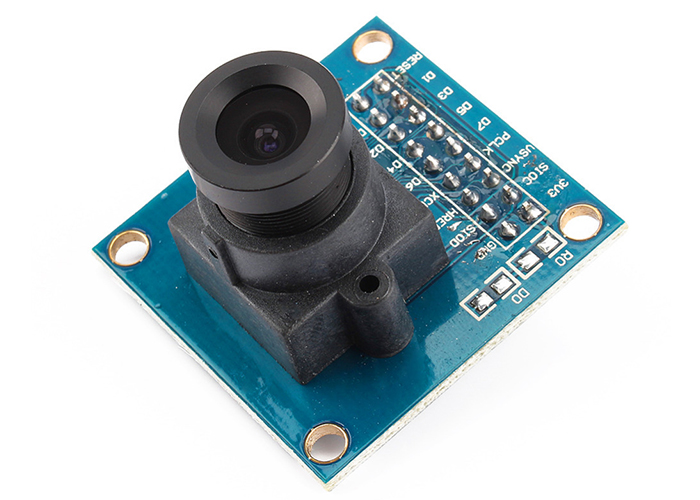
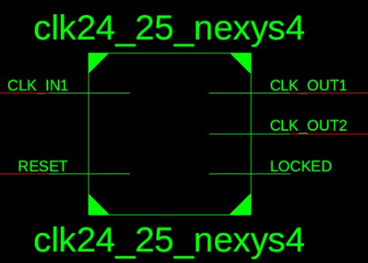
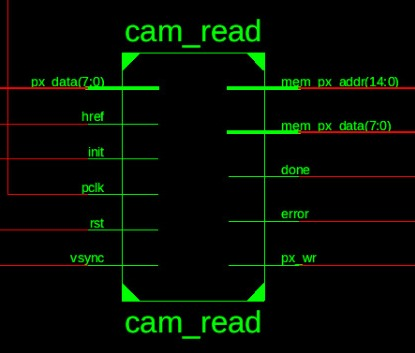
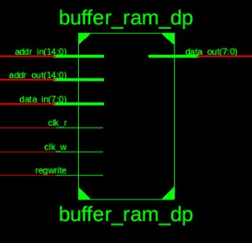
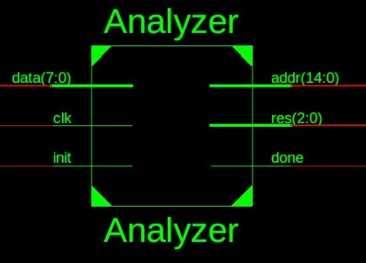
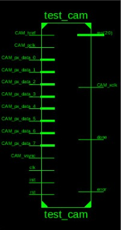
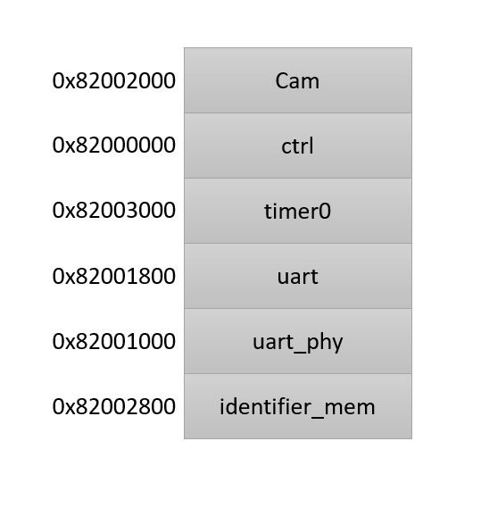
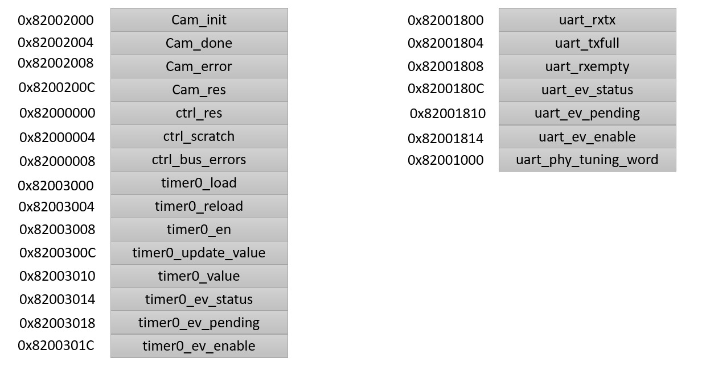
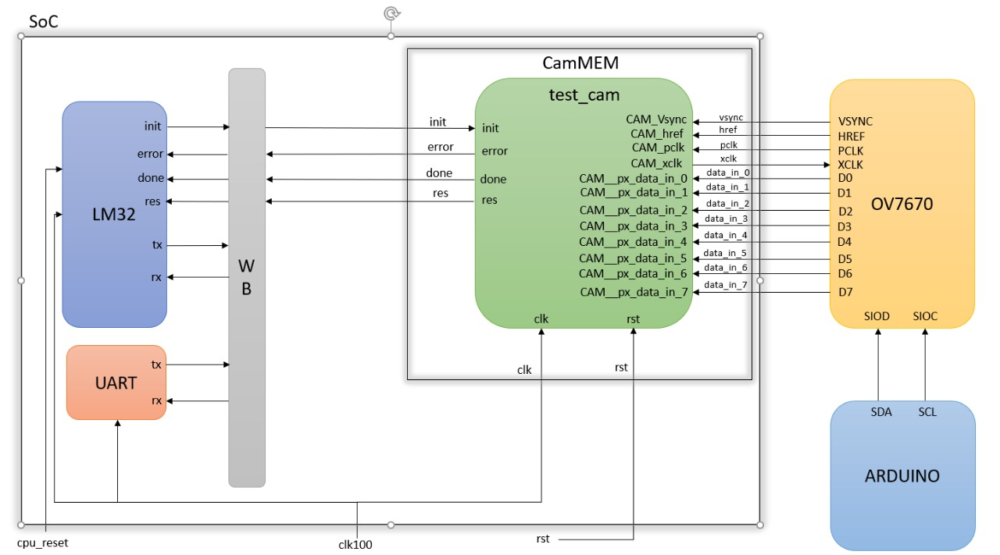

# Proyecto Electrónica Digital II

A continuación se enlistan y describen los diferentes periféricos y módulos tanto de Hardaware como de Software empleados para la realización del proyecto final del curso de Electrónica Digital II.

## Periféricos

### Cámara OV7670




La cámara 0V7670 es el principal periférico externo del proyecto y la fuente de los datos a procesar por medio de Hardware y Software. Es una cámara CMOS la cuál tiene 16 conectores que funcionan de la siguiente manera:

Los primeros dos conectores **3V3** y **GND**, son los pines de alimentación, donde el conector **3V3** debe recibir una tensión DC de 2.5 - 3.3 V, mientras el conector **GND** debe corresponder con el punto de tierra de la tensión aplicada. Los dos pines siguientes se denominan **SIOC** y **SIOD** y corresponden a las señales de clock y data para el bus serial de control de la cámara, o SCCB por sus siglas en inglés, las cuales permiten cambiar la configuración de la cámara por medio de los registros correspondientes en la cámara, cuya descripción más detallada se encuentra consginada en el [datasheet](https://github.com/unal-edigital2-2019-2/work03-lm32-grupo-1/blob/master/docs/datasheet/OV7670_2006.pdf).

Los siguientes 4 conectores corresponden a señales de sincronización de ldea cámara, las primeras 3 señales se denominan **VSYNC**, **HREF** y **PCLK** y corresponden a señales cuadradas generadas por la cámara, que determinan los tiempos de captura y transmisión de los datos por medio de la cámara, mientras la cuarta, denominada **XCLK**, es una señal externa de clock para la sincronización de la cámara. A continuación, se encuentran los pines de datos de salida de la cámara numeradas de **D7** a **D0** para formar una salida de 8 bits cuyo formato puede corresponder con YUV/YCbCr (4:2:2), RGB565/555, GRB (4:2:2) o Raw RGB Data, según cómo se la configure. Por último se encuentran las señales **PWDN** y **RESET**, las cuales son señales externas para la habilitación de los procesos de sincronización de la cámara, de modo que para operar sin interrupciones la señal **PWDN** debe estar en bajo y la señal **RST** en alto, ya que este es un reset negado.


## Configuración de la cámara
La cámara trae incluido un procesamiento de la imagen que captura lo cual le permite enviar la imagen en diferentes formatos...

## Hardware

A continuación se enlistan y describen los módulos de verilog empleados para la configuración de hardware por medio de la FPGA para la conexión con el periférico de la cámara y el procesamiento de sus datos de salida.

### Módulo clk24_25_nexys4
Este módulo corresponde al archivo ***clk24_25_nexys4.v***, es el encargado de generar los clocks necesarios para que funcione adecuadamente la comunicación con la cámara y el procesamiento de la información relativa a esta por medio de los demás módulos de verilog, además de enviar la señal de reloj que alimenta la cámara. Este módulo fue generado empleando la herramienta *clocking wizard* del Core Generator de Xilinx, para facilitar el proceso de división del clock original de la FPGA, correspondiente a 100 MHz y obtener las señales de reloj de 24 y 25 MHz requeridas.

El diagrama de bloques de este módulo se presenta en la siguiente gráfica, donde es posible observar sus entradas, correspondientes a la señal de reloj original y la señal de reset global; y sus salidas, correspondientes a las señales de reloj antes mencionadas y una salida LOCKED generada por el wizard.




### Módulo cam_read

Este módulo corresponde al archivo ***cam_read.v***, es el módulo encargado del procesamiento de los datos y las señales de sincronización de la cámara para poder leer los datos enviados por la cámara en formato RGB 565 y enviarlos a la memoria RAM en formato 332 para su almacenamiento. Para tal fin se emplea una máquina de estados finitos sincronizada con ***pclk***, cuyos estados están definidos por las señales ***init***, ***init_old***, ***start***, ***vsync*** y ***vsync_old***. El primero de estos depende únicamente de **init*** e ***init_old*** y lleva a la señal ***start*** a un valor de 1, mientras que hace a la señal ***done*** igual a 0; el segundo estado asegura que no se pase al tercero hasta que la señal ***vsync*** sea cero y la señal ***vsync_old*** sea 1
Dicha máquina cuenta con 2 estados, el primero de ellos corresponde a la transcripción de datos registrados por la cámara al vector de salida del módulo de acuerdo con la codificación de 8 bits definida para el formato 565 además de mantener la señal de escritura (***px_wr***) en 0, mientras el segundo estado pasa la señal de escritura a 1, aumenta el valor de la dirección de salida (***mem_px_addr***) y reescribe la información de los primeros bits del vector de salida (***mem_px_data[1,0]***) con la información de los bits ***mem_px_data[4,3]***.



### Módulo buffer_ram_dp
Este módulo es el encargado de recibir los datos en formato 332 y almacenarlos para su posterios envio al módulo Analyzer. Toma como entradas dos clocks, uno de lectura y otro de escritura.Tiene también tiene una dirección de lectura (conectada al Analyzer) y una dirección de estcritura (Conectada a cam_read). Recibe del módulo cam_read una señal que habilita la escritura para asegurarse de escribir en la memoria cuando ya se tenga adquirido un dato válido.




### Módulo Analyzer
El módulo Analyzer pide información a la RAM y la procesa devolviendo que componente RGB es el predominante en la foto tomada y es conectado al Wishbone para poder ser leído por el procesador. 

Este módulo toma como entradas un dato que es enviado desde la ram, una señal de init que indica cuando empezar la operación y un clock de 25Mhz. Cuando la señal init se activa el módulo envia a la RAM una dirección de memoria y recibe el dato de esta dirección. Al ir recorriento todos los datos de la ram este módulo va sumando los componentes en R, en G y en B de cada pixel recibido y al completar los 19200 pixeles en vía como resultado un bus de tres bits indicando cuál de los tres colores fue el que llegó a la suma mayor y por lo tanto que componente de color es el predominante en el frame.

Además de la señal res, que es la que se conecta al wishbone y para ser leida por el procesador, el módulo también activa la señal de done que es la que usa el procesador para poder realizar la correcta interpretación del bus de datos res a el color RGB.



### Módulo test_cam
Este módulo instancia los cuatro módulos anteriores y conecta sus salidas al wishbone para ser usadas por el procesador.



Este es el módulo del cual se crea una instancia en el archivo CamMEM.py lo que sirve para posteriormente integrarse en el SoC

## LM32
El procesador LM32 es el maestro que recibe señales de status de la cámara y de los diferentes periféricos.

En el proyecto el procesador envía una señal de init al wishbone que esta conectado al módulo test_cam y esto le permite activar la captura del frame. Despues de el frame capturado, el procesador recibirá las señales de done, error y res para poder de acuerdo a estas codificar el color predominate en el frame y enviar esta información a la UART para su posterior visualización serial. Esto se realiza cargandole al procesador el siguiente programa.

```c
int main(void)
{
	irq_setmask(0);
	irq_setie(1);
	uart_init();

	puts("\nexample   lm32-CONFIG camera"__DATE__" "__TIME__"\n");

	uint8_t color = 0;
	uint8_t done = 0;
	uint8_t error = 0;

	
	while(1) {
		color = Cam_res_read(); 
		done = Cam_done_read();
		error = Cam_error_read();
		if(done){
			if(!error){
				switch (color){
	 				case 1: printf("Azul \n"); break;
	 				case 2: printf("Verde \n"); break;
	 				case 4: printf("Rojo \n"); break;
	 				case 7: printf("Ninguno \n"); break;
				}
			}
		}
	Cam_init_write(1);
	wait_ms(10);
	Cam_init_write(0);
	wait_ms(90);
	}

	return 0;
}

```

## UART

En este proyecto el uso de la UART es exclusivo para la visualización serial del color después de que el procesador lo ha enviado. Esta unidad uart, funciona por interrupciones, lo que significa que el procesador no se detendrá mientras la UART esta realizando sus operaciones, sino que ésta avisará al procesador cuando halla culminado sus operación y le entregará posteriormente el resultado de esta.

## WB

El wishbone es un bus de datos que conecta los perifericos del SoC. Esto con la finalidad de hacer que el procesador vea a los perifericos como registros en memoria, el mapeo de los periféricos en la memoria se muestra a continuación:



Cada uno de estos periféricos tiene en la memoria una dirección correspondiente a sus registros de estatus y control que serán usados por el procesador. El mapeo es el siguiente:



Se puede observar que en este mapeo de memoria aparecen todas las señales que el procesador usa para comunicarse con los periféricos dentro del SoC y algunas que usa el procesador para poder cumplir sus tareas.
## SoC

El system on chip (SoC) es el lugar donde se unen todos los periféricos y se conectan al wishbone para poder ser usador por el procesador, que los vé como memoria.

El diagrama de conexión del Soc se muestra a continuación:


